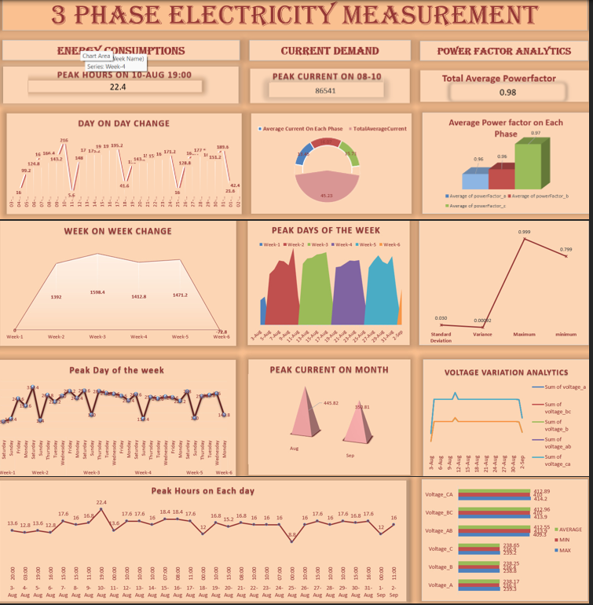
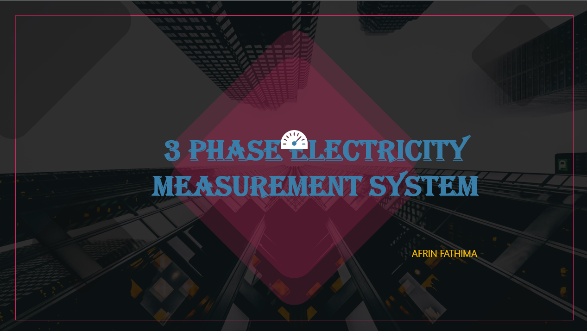
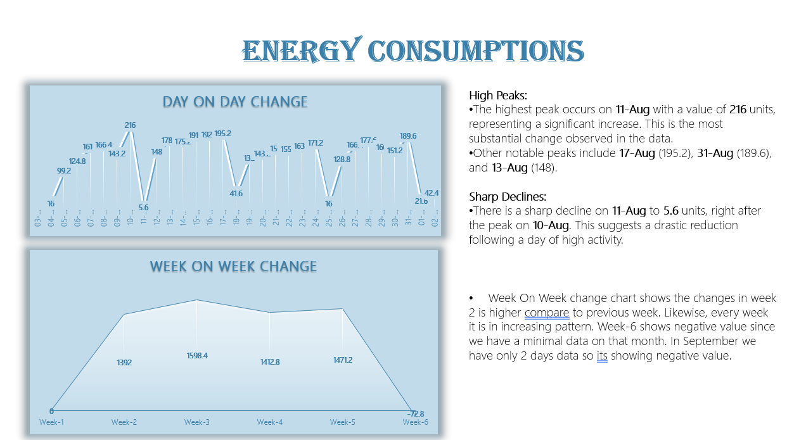
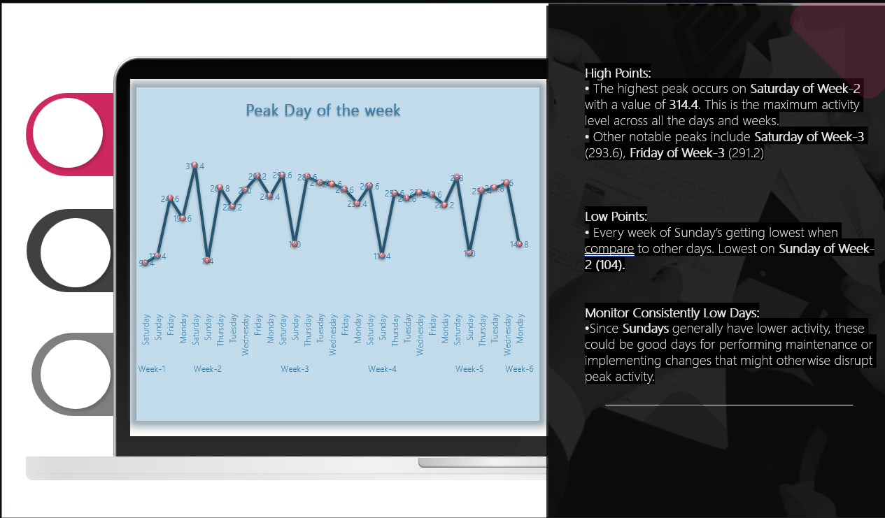
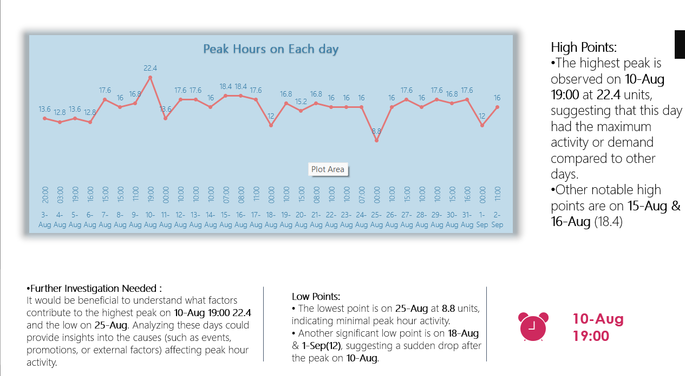
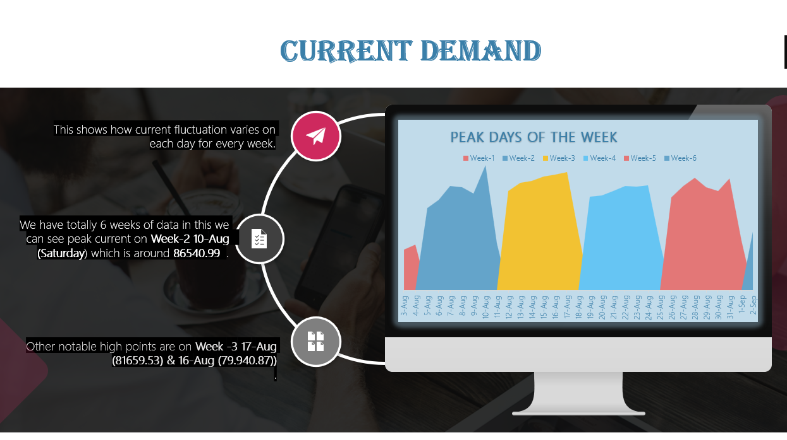
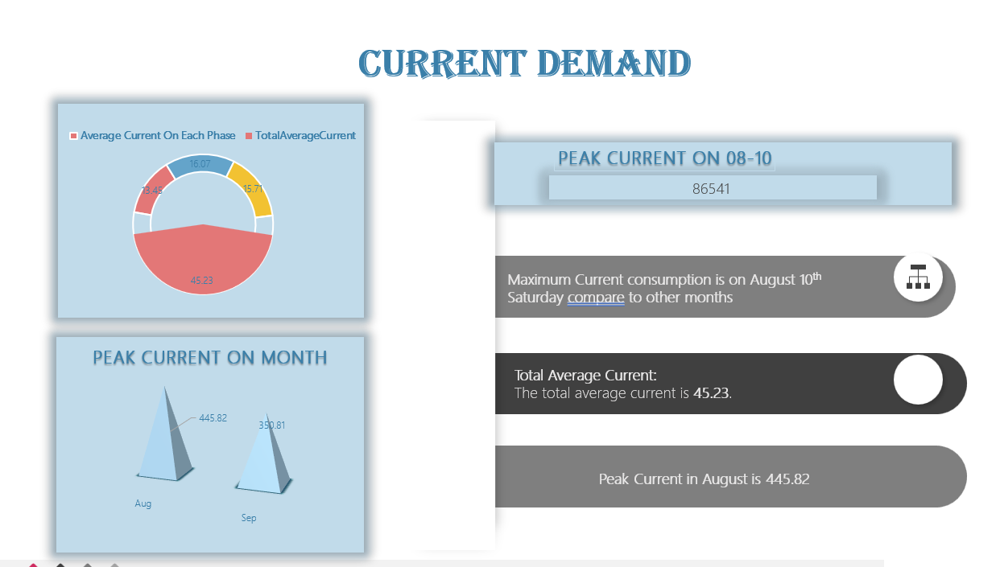
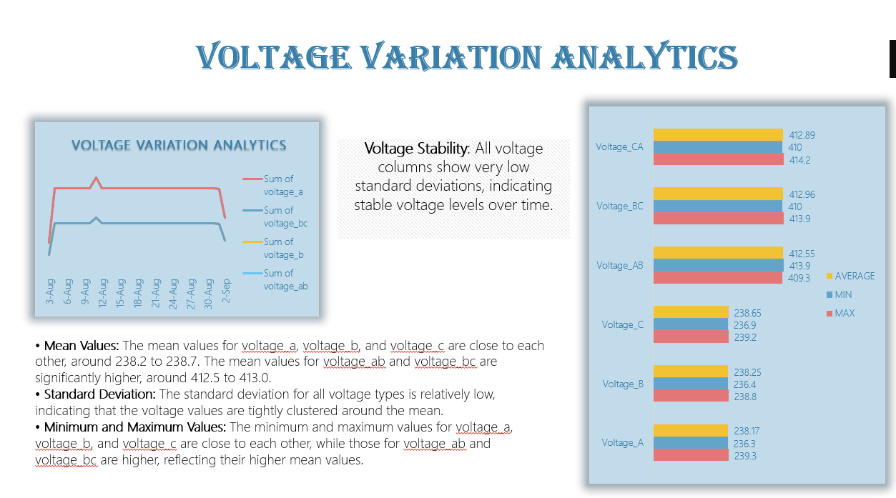
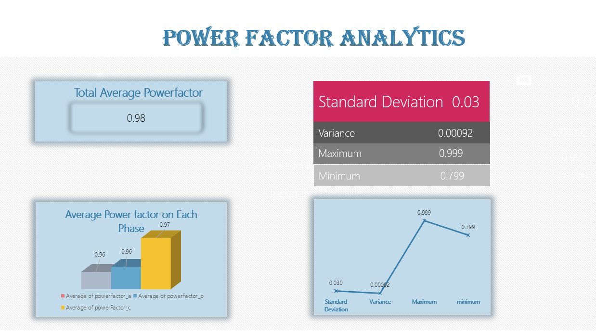

## Introduction
Designed and implemented a "3-Phase Electricity Measurement System" to accurately monitor voltage, current, power, and energy consumption for industrial applications. 
The project involved sensor integration, signal processing, and data acquisition using microcontrollers/embedded systems, enhancing real-time monitoring and energy efficiency analysis.

### DataSet - One month Dataset to predict below Problem Statement

### Problem Statement:
1. Energy Consumptions - Day on Day, Week on week, Peak hour, peak days of the week etc.
2. Current demand - Peak current, Average current, Peak days of the week, Peak of the month etc.
3. Voltage variation analytics
4. Power Factor analytics
   
### Skills Used:
- Power Pivot
- Pivot Table
- Calculated Field
- Data Model
- Excel Functions

# DashBoard 

# Presentation

